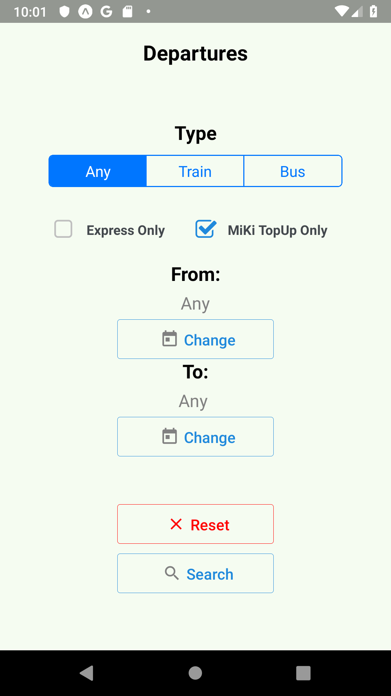

# Departures

### Android
  

### iOS
  

## Installation

Install Expo CLI

```bash
npm install expo-cli --global
```

```bash
npm install
```
For details: https://docs.expo.io/versions/v34.0.0/introduction/installation/

## Testing
The data fetching, caching and filtering logic is unit tested. To run the test, do:

```bash
npm run test
```

## Run with Expo (Recommeneded)

Start Android/iOS Simulators from Android Stuido/Xcode then run the following commands:

```bash
npm run android
```

```bash
npm run ios
```

## Run with Android Studio/Xcode and Distribution

Eject to ExpoKit to create Android and Xcode project files:

```bash
expo eject
```
For details: https://docs.expo.io/versions/latest/expokit/eject/

### Google Play Distribution
https://developer.android.com/google/play/dist

### App Store Distribution
https://developer.apple.com/business/distribute/


## Known Issues


If you experience network error like this, try using mock data by setting 'useMockDataForDebug' to true in constants.js
```javascript
const useMockDataForDebug = true;
```

## License
[MIT](https://choosealicense.com/licenses/mit/)
