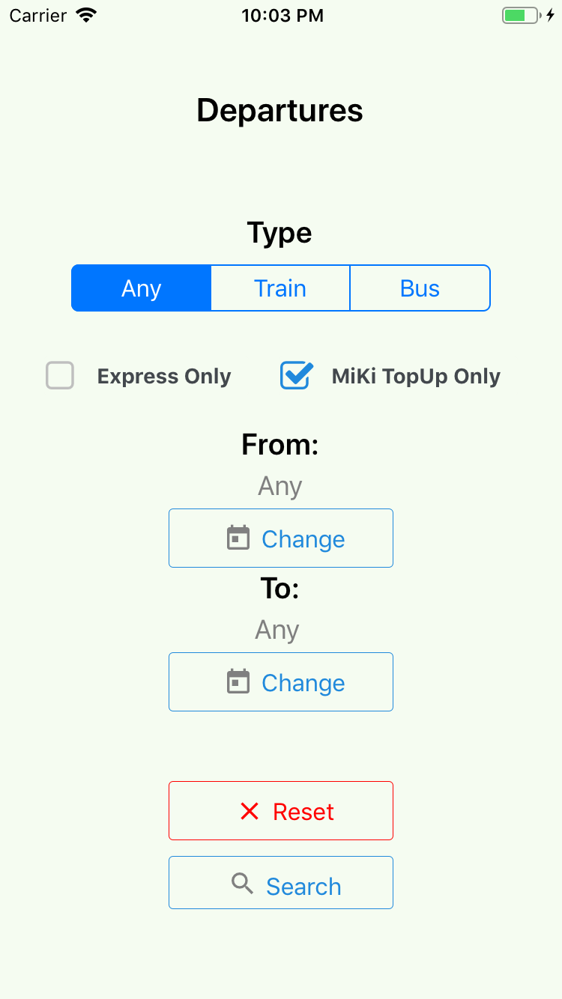

# Departures

### Android
  

### iOS
  

## Installation

```bash
npm install
```

## Testing

```bash
npm run test
```


## Usage

```bash
npm run android
```

```bash
npm run ios
```


## License
[MIT](https://choosealicense.com/licenses/mit/)
